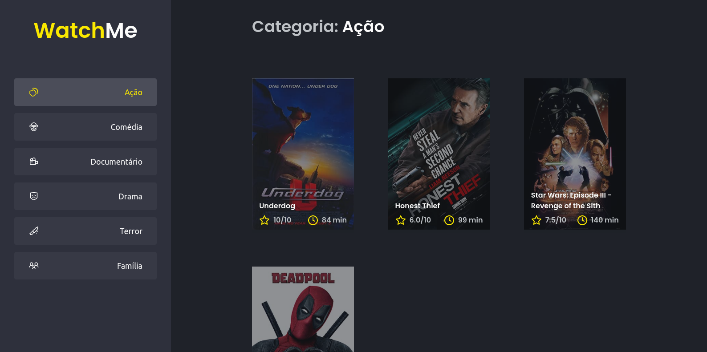

  # Desafio 02 - Componentizando a aplicação


> _Obrigado a Rocketseat :rocket: pela imagem acima!_

### 🗒️ Sobre o desafio

Nesse desafio, você deverá criar uma aplicação para treinar o que aprendeu até agora no ReactJS

Essa será uma aplicação onde o seu principal objetivo é refatorar uma página para listagem de filmes de acordo com gênero.

A aplicação já está totalmente funcional mas grande parte do seu código está diretamente no arquivo `App.tsx`. Para resolver isso da melhor forma, é necessário dividir a aplicação em **pelo menos** duas partes principais: sidebar e o conteúdo principal que possui o header e a listagem de filmes.

**Como e o que deve ser feito:**

- A aplicação possui apenas uma funcionalidade principal que é a listagem de filmes;
- Na sidebar é possível selecionar qual categoria de filmes deve ser listada;
- A primeira categoria da lista (que é "Ação") já deve começar como marcada;
- O header da aplicação possui apenas o nome da categoria selecionada que deve mudar dinamicamente.

### :paintbrush: Template da aplicação

https://github.com/rocketseat-education/ignite-template-componentizando-a-aplicacao

### :man_technologist: Comandos para execução

```bash
  # Instalar dependências
  yarn install

  # Iniciar aplicação
  yarn dev
```

### :camera_flash: Screenshot da resultado



> Design da aplicação feito pela Rocketseat! :rocket:
